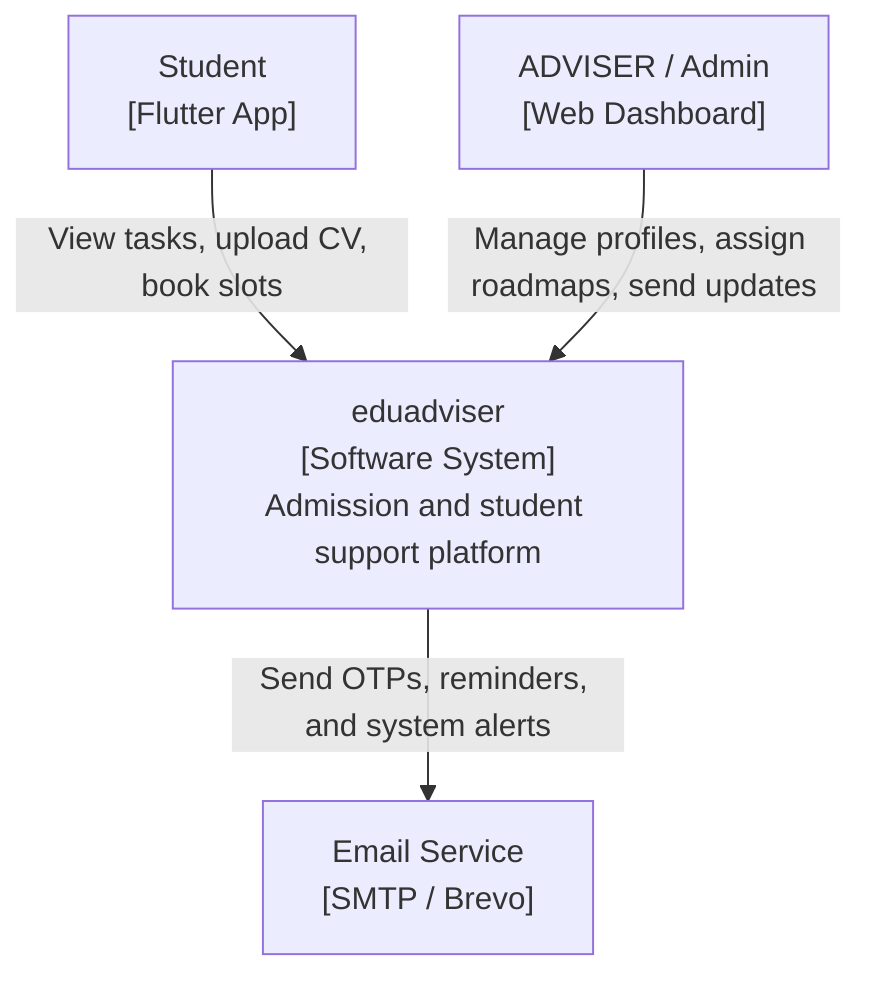
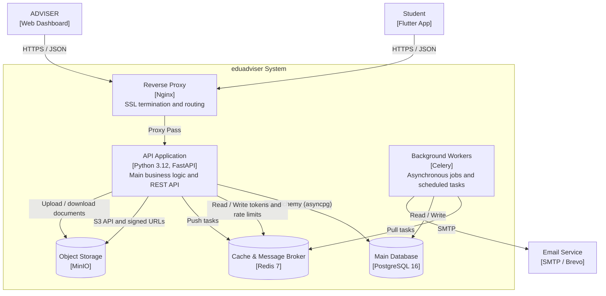

# eduadviser Architecture

This document describes the eduadviser backend at two architectural levels. The first diagram shows the system in its external context, while the second explains the internal container boundaries and runtime responsibilities.

## C4 Level 1: Context

This level shows the eduadviser system as a single software boundary and the people and external services it interacts with. It is useful for explaining who uses the platform and which outside systems the backend depends on.

- Student: uses the Flutter mobile app to manage personal progress, documents, tasks, and appointments.
- ADVISER / Admin: uses the web dashboard to manage students, content, roadmaps, and operations.
- eduadviser: the core software system that exposes the backend API and business workflows.
- Email Service: external SMTP provider used for OTPs, reminders, and transactional notifications.

## C4 Level 2: Container

This level breaks the system into deployable runtime containers and shows how requests move between them. It is useful for implementation planning because it highlights the API, persistence, queueing, storage, and background processing responsibilities.

- Nginx: handles TLS termination, reverse proxying, and request routing to the API.
- API Application: the FastAPI backend that contains the domain logic, authentication, and REST endpoints.
- PostgreSQL: persistent storage for users, academic data, tasks, appointments, and other business entities.
- Redis: used as both cache and broker for transient state such as tokens, rate limits, and queued jobs.
- Celery Workers: process asynchronous tasks such as emails, reminders, cleanup jobs, and other background workflows.
- MinIO: stores uploaded files and media assets with S3-compatible access patterns.
- Email Service: sends transactional mail outside the request path.