# eduadviser Database

This document presents the database model for the eduadviser backend. The ER diagram shows how the core entities relate to each other, and the table below explains how each entity supports the business process.

## ER Diagram

```mermaid
erDiagram
    USER ||--|| PROFILE : has
    USER ||--o{ DOCUMENT : uploads
    USER ||--o{ TASK : assigned_to
    USER ||--o{ TASK : created_by
    USER ||--o{ NOTIFICATION : receives
    USER ||--o{ CALENDAR_EVENT : has
    USER ||--o{ CONVERSATION : participates_in
    USER ||--o{ MESSAGE : sends
    USER ||--o{ APPOINTMENT : books_or_hosts
    USER ||--o{ APPOINTMENT_SLOT : opens
    USER ||--o{ ROADMAP : creates
    USER ||--o{ STUDENT_ROADMAP : assigned
    USER ||--o{ NEWS : authors
    USER ||--o{ FAQ : creates
    USER ||--o{ ALUMNI : authors

    ROADMAP ||--o{ ROADMAP_TEMPLATE_TASK : contains
    ROADMAP ||--o{ STUDENT_ROADMAP : assigned_via
    STUDENT_ROADMAP ||--o{ TASK : generates

    CONVERSATION ||--o{ MESSAGE : contains

    APPOINTMENT_SLOT ||--o| APPOINTMENT : booked_as

    UNIVERSITY ||--o{ UNIVERSITY_PROGRAM : offers
    UNIVERSITY ||--o{ ALUMNI : attended_by

    USER {
        uuid id PK
        string email
        string full_name
        string role
        boolean is_active
        string avatar_url
        datetime created_at
    }

    PROFILE {
        uuid id PK
        uuid user_id FK
        string group_type
        int course_year
        float gpa
        boolean ielts_passed
        float ielts_score
        date ielts_date
        boolean sat_passed
        int sat_score
        date sat_date
        int ent_score
        int kta_score
        string target_country
        string target_major
        string notes
    }

    DOCUMENT {
        uuid id PK
        uuid student_id FK
        string doc_type
        string url
        string content_type
        int size
        datetime created_at
    }

    TASK {
        uuid id PK
        uuid student_id FK
        uuid created_by FK
        uuid student_roadmap_id FK
        string title
        string description
        string status
        string priority
        datetime deadline
        datetime completed_at
        boolean is_ADVISER_task
        datetime created_at
    }

    ROADMAP {
        uuid id PK
        uuid created_by FK
        string title
        string description
        string target_type
        boolean is_public
        datetime created_at
    }

    ROADMAP_TEMPLATE_TASK {
        uuid id PK
        uuid roadmap_id FK
        string title
        string description
        int order_index
        int days_offset
        datetime created_at
    }

    STUDENT_ROADMAP {
        uuid id PK
        uuid student_id FK
        uuid roadmap_id FK
        uuid assigned_by FK
        string title
        datetime assigned_at
        boolean is_active
    }

    CONVERSATION {
        uuid id PK
        uuid student_id FK
        uuid ADVISER_id FK
        datetime last_message_at
        datetime created_at
    }

    MESSAGE {
        uuid id PK
        uuid conversation_id FK
        uuid sender_id FK
        string sender_role
        string body
        boolean is_read
        datetime read_at
        datetime created_at
    }

    NOTIFICATION {
        uuid id PK
        uuid user_id FK
        string title
        string body
        string type
        boolean is_read
        datetime read_at
        uuid source_id
        string source_type
        datetime created_at
    }

    APPOINTMENT_SLOT {
        uuid id PK
        uuid ADVISER_id FK
        datetime start_time
        datetime end_time
        int duration_min
        boolean is_available
    }

    APPOINTMENT {
        uuid id PK
        uuid slot_id FK
        uuid student_id FK
        uuid ADVISER_id FK
        string status
        string notes
        string cancel_reason
        datetime cancelled_at
        datetime created_at
    }

    UNIVERSITY {
        uuid id PK
        string name
        string country
        string city
        string website_url
        string description
        float acceptance_rate
        int qs_ranking
        int the_ranking
        boolean is_published
        datetime created_at
    }

    UNIVERSITY_PROGRAM {
        uuid id PK
        uuid university_id FK
        string name
        string degree_level
        string field
        float min_gpa
        float min_ielts
        int min_sat
        int tuition_usd
        string scholarship_info
        date deadline
        string apply_url
        boolean is_active
        datetime created_at
    }

    NEWS {
        uuid id PK
        uuid author_id FK
        string title
        string body
        string category
        date event_date
        boolean is_published
        int views_count
        datetime created_at
    }

    CALENDAR_EVENT {
        uuid id PK
        uuid user_id FK
        string title
        string event_type
        datetime start_time
        datetime end_time
        boolean all_day
        string color
        uuid source_id
        string source_type
        datetime created_at
    }

    FAQ {
        uuid id PK
        uuid created_by FK
        string question
        string answer
        string category
        int order_index
        boolean is_active
        datetime created_at
    }

    ALUMNI {
        uuid id PK
        uuid author_id FK
        uuid university_id FK
        string student_name
        int graduation_year
        string program_name
        string scholarship_type
        string story_text
        float gpa_at_time
        boolean is_published
        datetime created_at
    }
```

## Entity Summary

| Table | Business Meaning |
|---|---|
| `USER` | Stores the platform identities for students, ADVISERs, and admins. |
| `PROFILE` | Holds academic and application context for a student, including GPA, test scores, and target goals. |
| `DOCUMENT` | Represents uploaded student files such as CVs, motivation letters, and recommendation letters. |
| `TASK` | Tracks personal and ADVISER-assigned work items with deadlines and status. |
| `ROADMAP` | Defines a reusable guidance plan for a target admission path. |
| `ROADMAP_TEMPLATE_TASK` | Stores the template tasks that make up a roadmap. |
| `STUDENT_ROADMAP` | Captures a roadmap assignment to a specific student. |
| `CONVERSATION` | Represents a one-to-one chat channel between a student and a ADVISER. |
| `MESSAGE` | Stores individual chat messages inside a conversation. |
| `NOTIFICATION` | Stores in-app alerts delivered to a user. |
| `APPOINTMENT_SLOT` | Holds available meeting times opened by the ADVISER. |
| `APPOINTMENT` | Stores a booked consultation between a student and a ADVISER. |
| `UNIVERSITY` | Describes a university that can be shown, compared, and managed in the system. |
| `UNIVERSITY_PROGRAM` | Stores degree-level programs offered by a university. |
| `NEWS` | Represents deadlines, events, and announcements shared with students. |
| `CALENDAR_EVENT` | Stores user-visible calendar items created manually or generated from other processes. |
| `FAQ` | Contains frequently asked questions used for self-service support. |
| `ALUMNI` | Stores success stories and outcomes used for motivation and credibility content. |